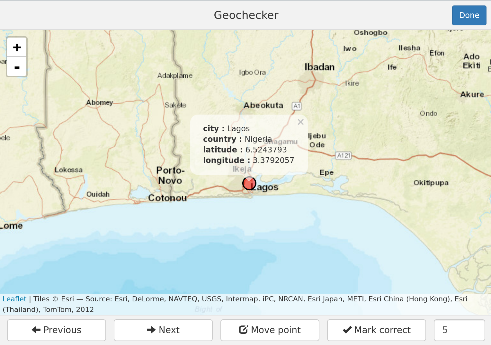

<!-- README.md is generated from README.Rmd. Please edit that file -->
geochecker
----------

An R package that lets you check the accuracy of geocoded coordinates using a [Shiny gadget](http://shiny.rstudio.com/articles/gadgets.html).

**Author:** [Lincoln Mullen](http://lincolnmullen.com)<br> **License:** [MIT](http://opensource.org/licenses/MIT)

[](http://cran.r-project.org/package=geochecker) [](https://travis-ci.org/lmullen/geochecker)

### Installation

To get the development version from GitHub, use [devtools](https://github.com/hadley/devtools).

``` r
# install.packages("devtools")
devtools::install_github("lmullen/geochecker")
```

### Use

Pass the `geocheck()` function a data frame containing latitudes and longitudes that have been geocoded. A Shiny gadget will open that will step you through each point and allow you to mark it as correct or to change the coordinates by clicking on the map. Be sure to save the data frame which is returned.

``` r
library(geochecker)
corrected <- geocheck(geocoded_cities, zoom = 8)
```



### Contributing

Please note that this project is released with a [Contributor Code of Conduct](CONDUCT.md). By participating in this project you agree to abide by its terms.
